# RedditAlike
## Development server link:
   [ This site may be unavailable(500) due to hosting plan limitations ]
   <https://reddit-alike-client.herokuapp.com>
### Technologies Used:
* FrontEnd: React, TypeScript, FluentUI React, Redux
* BackEnd: ASP.NET Core WebAPI (.NET Core 5)
* Database Engine: PostgreSQL
* Hosting:Frontend & Database Engine: Heroku, Backend: Azure App Service
### Features : 
* Users will be able to create their accounts so that the appropriate authentication
process can be applied across the application.
* Users will be prompted to login when their session expires.
* Authorized users will be able to write / post their thoughts.
* Authorized users will be able to edit their post.
* Authorized users will be able to remove their post.
* They can vote(Like/Dislike) on other people's posts.
* They can rollback/change votes on other people's posts.
* The overall voting status of a post will be updated according to the votes posted by the
users.
* Authorized users will be able to comment on other people’s posts.They can delete their
comments if they want.
* Anonymous users can read a post, see who voted for the post and commented on the
post.However, they will not be able to vote or comment.

## Preview
* HomePage(SignedOut)

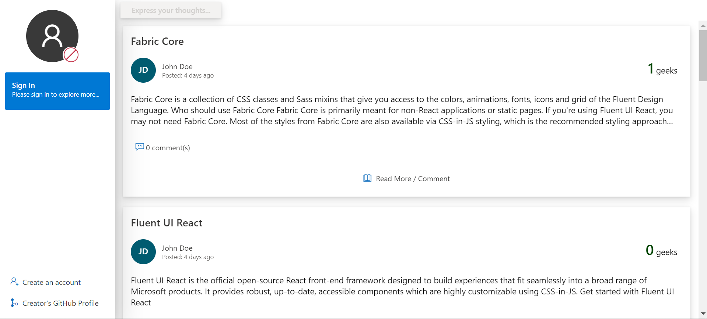

* SignInPage

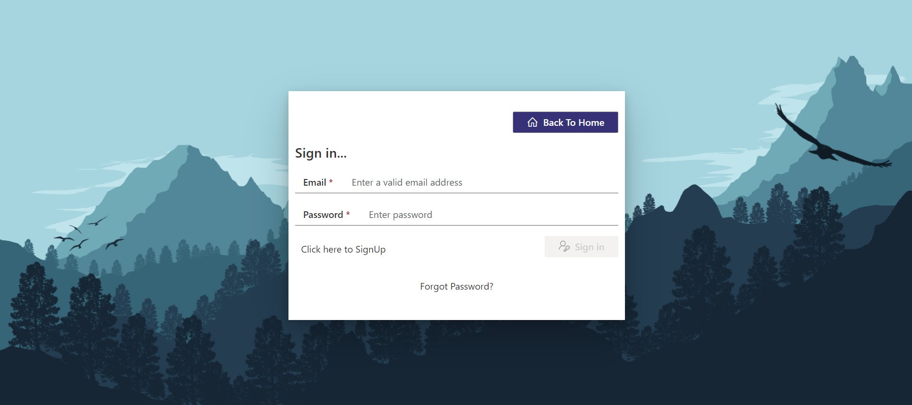

* SignUpPage

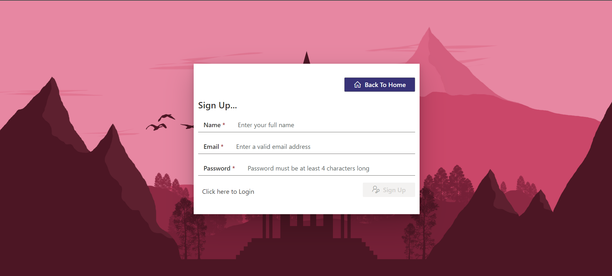

* Forgot-password Request

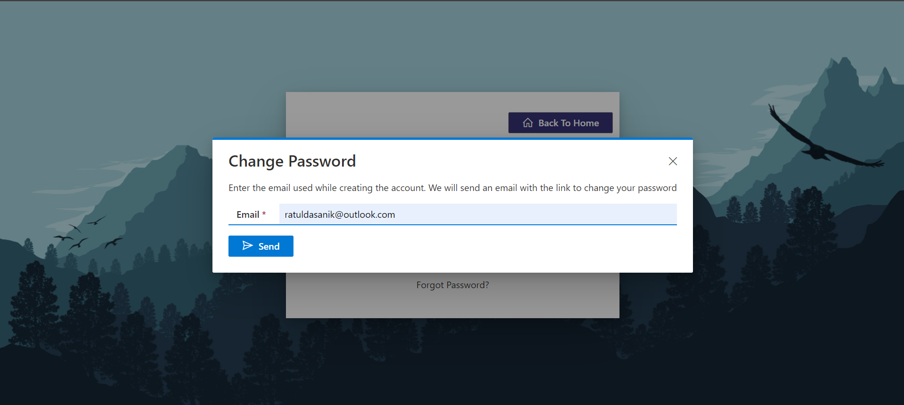

* HomePage(SignedIn)

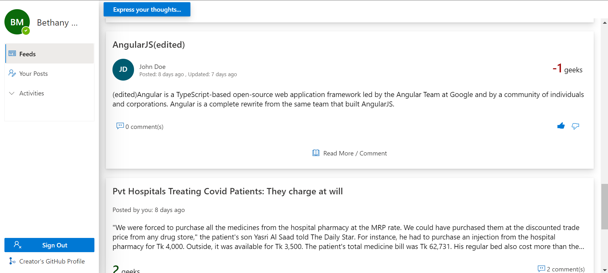

* Post-DetailsPage(Post Comment)

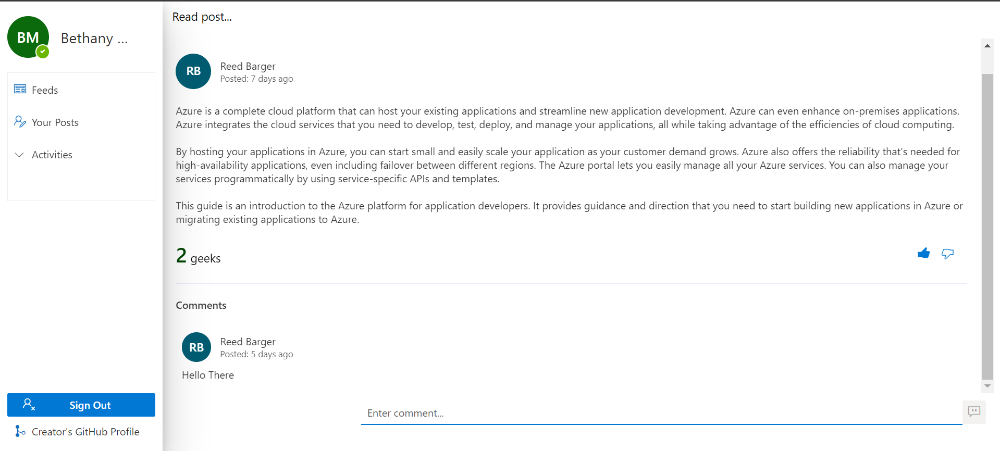

* Preview of votes

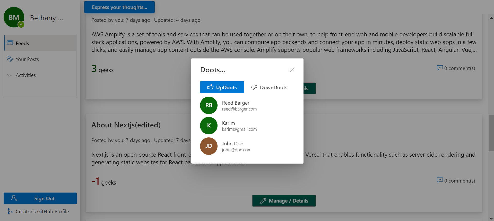

* Preview of comments

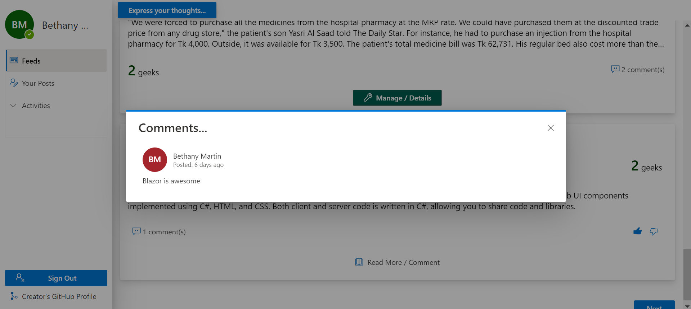

* Pagination

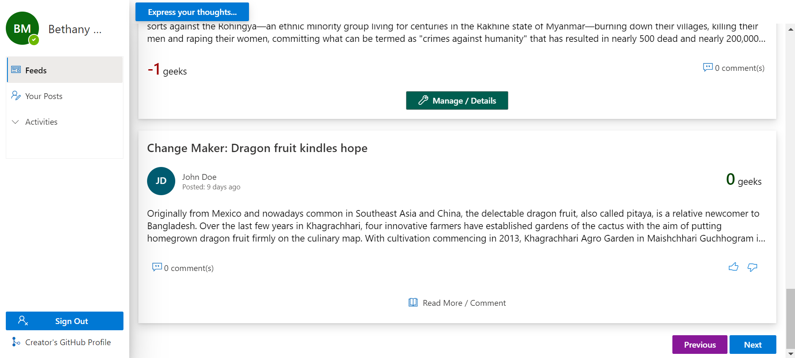

* Your-Posts page

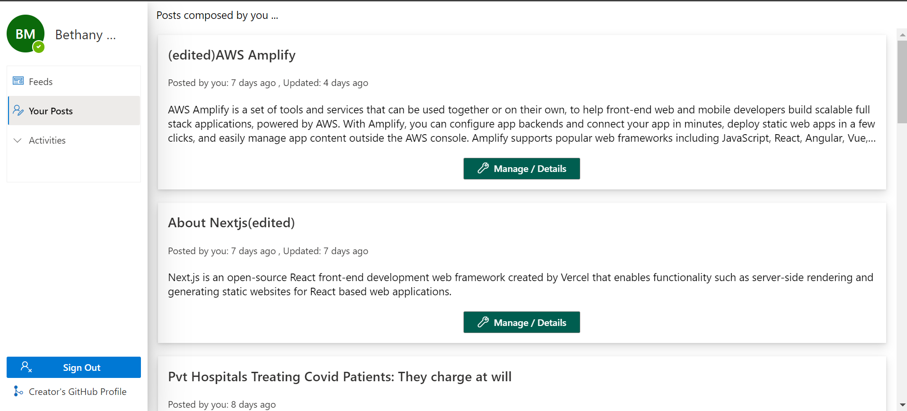

* Your-LikedPosts Page

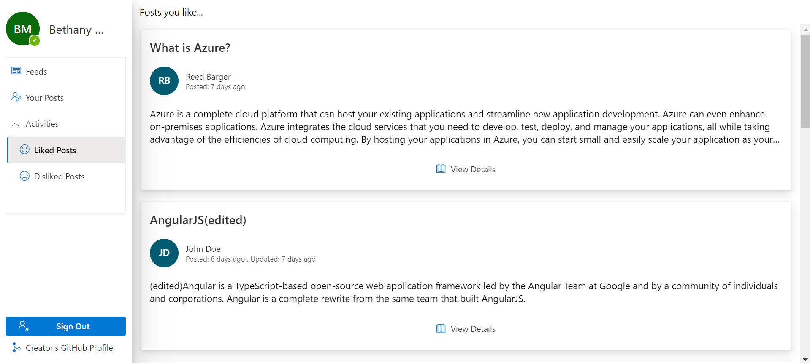

* Your-DislikedPosts Page

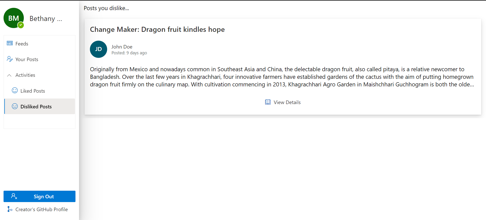

* Change-Password Page

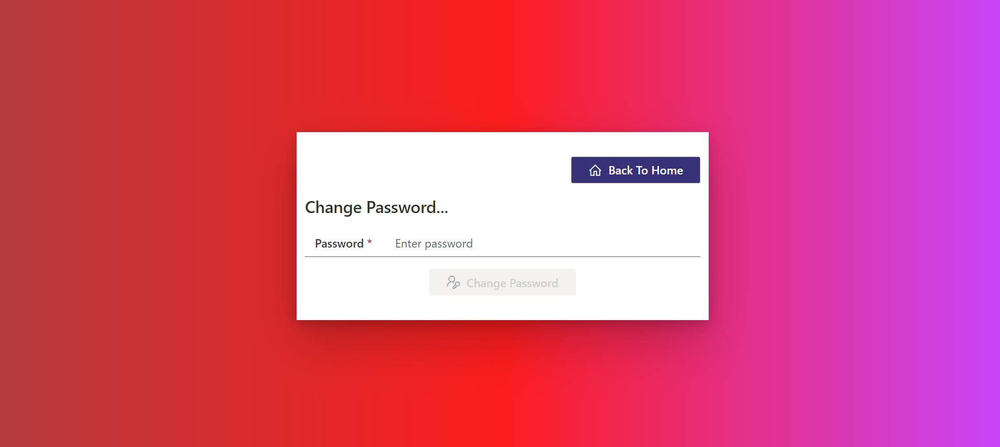

* Manage(Edit/Remove/Remove Comment) your post Page:

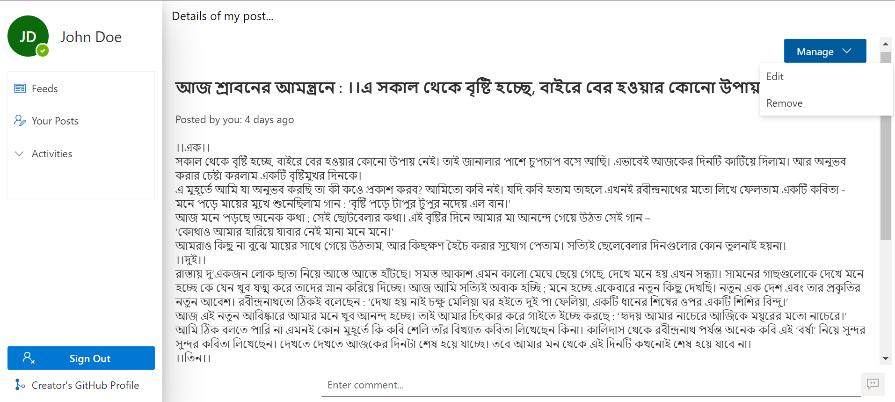
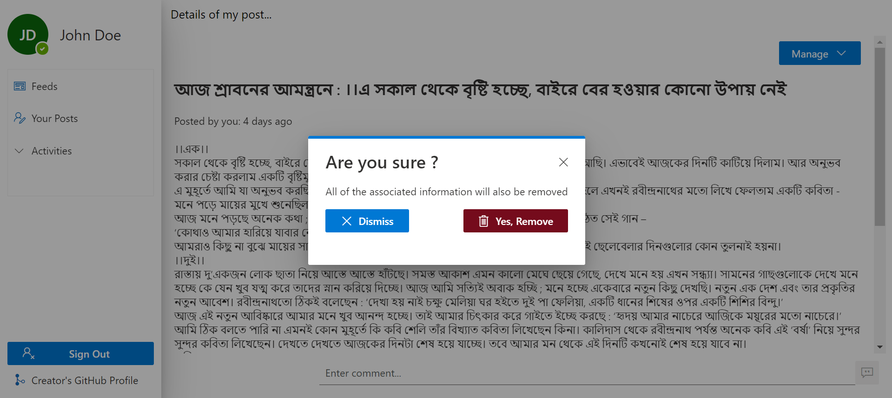
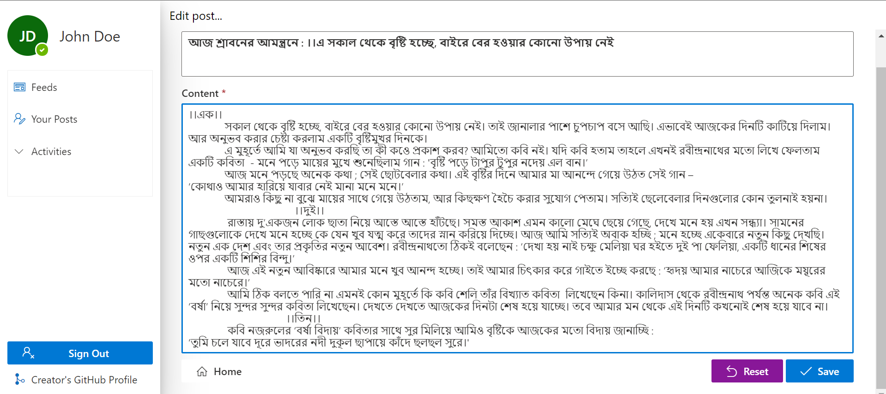
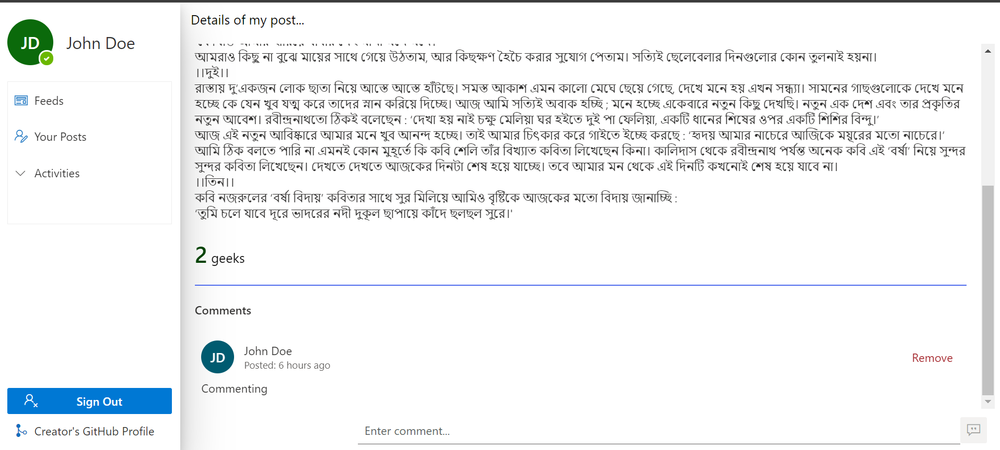